# Behavioral Cloning

## Overview
When we learn how to drive, we are taught by our parents and instructors. The same concept can be applied to deep learning. This technique is called behavioral cloning.
In this project, I used Udacity's driving simulator to gather data from the road and drive around a track. In the simulator, you are able to record yourself driving around. There is also an autonomous mode that will be used to test a deep learning model.

## Data
#### Collection
The data consists of three runs through two different tracks.
Each run records image files from three perspectives, accompanied by steering angle, throttle, brake, and speed.

Each run focused on staying in the center of the lane.

#### Augmentation
Each image is augmented in order to diversify the data. These augmentations include:
- Flipping the image
- Changing the brightness

## Sample Data
##### Track One (Mostly flat simple terrain)
- One run counter-clockwise
- One run clockwise

###### Sample Images
| Left | Center | Right |
|:----:|:------:|:-----:|
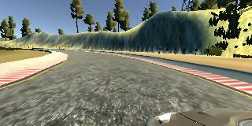|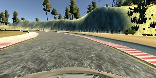|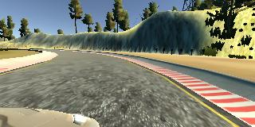|
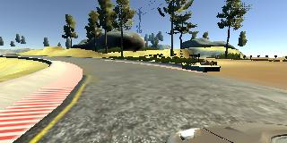|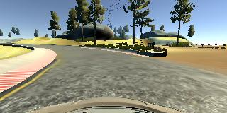|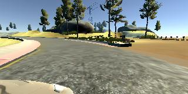|
###### Augmented Images
| Left | Center | Right |
|:----:|:------:|:-----:|
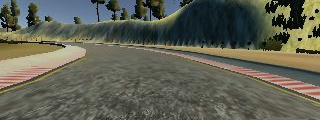|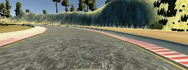|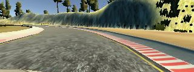|
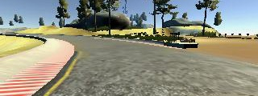|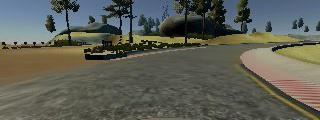|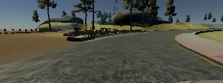|


##### Track Two (Mountainous terrain with sharp bends and inclines)
- One run counter-clockwise

###### Sample Images
| Left | Center | Right |
|:----:|:------:|:-----:|
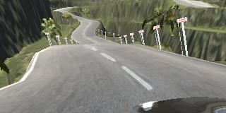|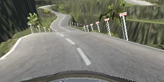|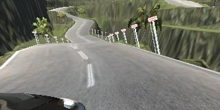|
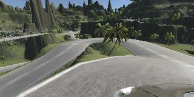|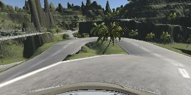|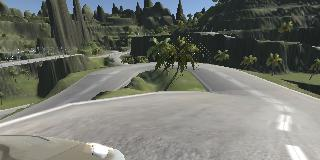|
###### Augmented Images
| Left | Center | Right |
|:----:|:------:|:-----:|
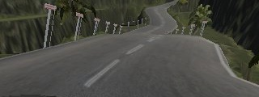|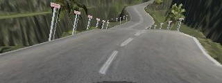|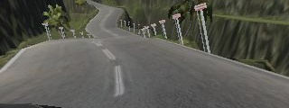|
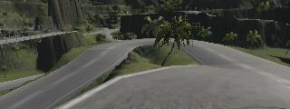|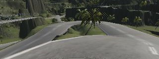|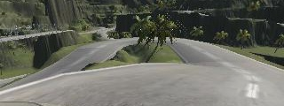|

##### Controller Values
A small sample of control values for the car

| Steering Angle | Throttle  | Brake | Speed       | 
|:--------------:|:---------:|:-----:|:-----------:| 
| -0.5096154     | 0.0356455 | 0     | 0.003512016 | 
| -0.5192308     | 0.2164628 | 0     | 0.1127652   | 
| -0.5480769     | 0.4560913 | 0     | 0.4727774   | 
| -0.5961539     | 0.6360458 | 0     | 0.8249434   | 
| -0.625         | 0.820002  | 0     | 1.374682    | 
| -0.625         | 1         | 0     | 2.290736    | 
| -0.625         | 1         | 0     | 2.986865    | 
| -0.625         | 1         | 0     | 3.920481    | 
| -0.625         | 1         | 0     | 4.613889    | 
| -0.6057692     | 1         | 0     | 5.303838    | 
| -0.5384616     | 1         | 0     | 6.223863    | 

## Model
The model first preprocessed the data. First, image values are rescaled between 0 and 1 by dividing 255.

Afterwards, images are cropped. This eliminates the sky and bonnet of the car, which for the most part, are unnecessary. This also reduces the dimensionality of the network, reducing training time and model size.

#### Preprocessed Images
Images are cropped and rescaled before being fed through the model.

| Left | Center | Right |
|:----:|:------:|:-----:|
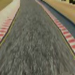|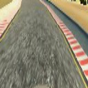|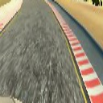|
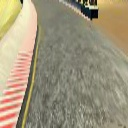|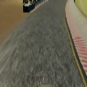|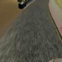|
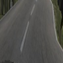|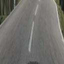|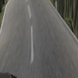|
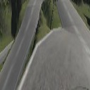|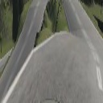|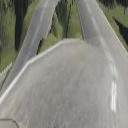|

### Model Architecture
The problem is boiled down to a regression based off of images. Thus, a convolutional neural network provides the best foundation to solve this problem.
The exact architecture was chosen through a solution designed approach. That is, whichever allowed the car to navigate around the track.

The image is then fed through 4 convolutional layers. The first layer consists of 1x1 convolutions while the rest are 3x3 kernels.

The output of the convolutional layers are fed through 2 fully connected layers.

Finally the network outputs one value representing steering angle.

Each layer is activated using Relu to provide nonlinearity.

Overfitting is a major consideration since the data is not very diverse, since the data is comprised of images from only two tracks.
To reduce overfitting, I implemented batch normalization and dropout layers. Dropout helps create redundancy in the network, such as multiple ways to identify the lane.

```
_________________________________________________________________
Layer (type)                 Output Shape              Param #
=================================================================
lambda_1 (Lambda)            (None, 160, 320, 3)       0
_________________________________________________________________
cropping2d_1 (Cropping2D)    (None, 120, 320, 3)       0
_________________________________________________________________
lambda_2 (Lambda)            (None, 64, 64, 3)         0
_________________________________________________________________
conv2d_1 (Conv2D)            (None, 64, 64, 3)         12
_________________________________________________________________
batch_normalization_1 (Batch (None, 64, 64, 3)         12
_________________________________________________________________
activation_1 (Activation)    (None, 64, 64, 3)         0
_________________________________________________________________
conv2d_2 (Conv2D)            (None, 31, 31, 32)        896
_________________________________________________________________
batch_normalization_2 (Batch (None, 31, 31, 32)        128
_________________________________________________________________
activation_2 (Activation)    (None, 31, 31, 32)        0
_________________________________________________________________
conv2d_3 (Conv2D)            (None, 15, 15, 64)        18496
_________________________________________________________________
batch_normalization_3 (Batch (None, 15, 15, 64)        256
_________________________________________________________________
activation_3 (Activation)    (None, 15, 15, 64)        0
_________________________________________________________________
conv2d_4 (Conv2D)            (None, 7, 7, 128)         73856
_________________________________________________________________
batch_normalization_4 (Batch (None, 7, 7, 128)         512
_________________________________________________________________
activation_4 (Activation)    (None, 7, 7, 128)         0
_________________________________________________________________
conv2d_5 (Conv2D)            (None, 3, 3, 256)         295168
_________________________________________________________________
batch_normalization_5 (Batch (None, 3, 3, 256)         1024
_________________________________________________________________
activation_5 (Activation)    (None, 3, 3, 256)         0
_________________________________________________________________
flatten_1 (Flatten)          (None, 2304)              0
_________________________________________________________________
dropout_1 (Dropout)          (None, 2304)              0
_________________________________________________________________
dense_1 (Dense)              (None, 128)               295040
_________________________________________________________________
batch_normalization_6 (Batch (None, 128)               512
_________________________________________________________________
activation_6 (Activation)    (None, 128)               0
_________________________________________________________________
dropout_2 (Dropout)          (None, 128)               0
_________________________________________________________________
dense_2 (Dense)              (None, 128)               16512
_________________________________________________________________
batch_normalization_7 (Batch (None, 128)               512
_________________________________________________________________
activation_7 (Activation)    (None, 128)               0
_________________________________________________________________
dropout_3 (Dropout)          (None, 128)               0
_________________________________________________________________
dense_3 (Dense)              (None, 1)                 129
=================================================================
Total params: 703,065
Trainable params: 701,587
Non-trainable params: 1,478
_________________________________________________________________
Train on 12486 samples, validate on 2676 samples
```

## Training
The model was trained using the dataset described above. The augmented images helped provide pseudo-data that was different from the original.
In this particular instance, I was able to use Keras's _fit_ function. However, this may be a problem when there is more data that memory cannot hold all at one time.
The solution to this is to use Keras's _fit_generator_ function. This function only holds a few batches at a time instead of the entire dataset in memory.
However, there is a trade off between speed and memory.

- _model.fit_ is able to preprocess the entire dataset and is readily avaiable, but fails when the dataset is too large.
- _model.fit_generator_ is divide the dataset into chunks but will have to process the data each time.

## Results
Ultimately, the model was able to drive around Track One smoothly. Although not shown here, I manually steered the car toward one side of the road and it corrected itself back to the center.
This shows that the car is not simply driving down a predetermined route and is robust to different situations.

<a href="http://www.youtube.com/watch?feature=player_embedded&v=EvfkU8xFkZA
" target="_blank"></a>

<a href="http://www.youtube.com/watch?feature=player_embedded&v=6Cr-JwSrklI
" target="_blank"></a>